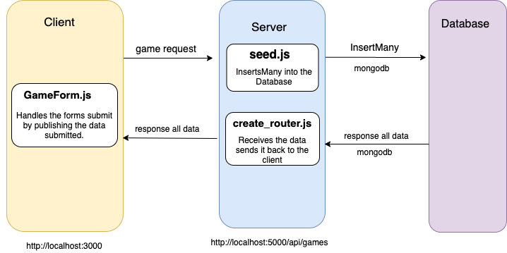

# Homework: Full Stack Games Hub App

### Learning Objectives

- Understand the relationship between client, server and database
- Be able to navigate a codebase that you haven't written

## Brief

Your boss has asked to you look over the codebase of a full-stack JavaScript application. The front-end is written in JavaScript using Vue, the back-end uses an Express server and a MongoDB database. Your task is to make yourself familiar with the codebase.

The application includes a README.md with instructions on running the application.

*Overview of the tech stack and tooling with commands*

## MVP

### Task

Draw a diagram showing the dataflow through the application starting with a form submission, ending with the re-rendering of the page. This will involve a multi-direction data-flow with the client posting data to the server and the server sending data back to the client with the response. Detail the client, server and database in the diagram and include the names of the files involved in the process.

### Questions

1. What is responsible for defining the routes of the `games` resource?
> `/server/helpers/create_router.js`

2. What do you notice about the folder structure?  Whats the client responsible for? Whats the server responsible for?
> The client is responible for the front end. While the server is responsible for the back end of the database.

3. What are the the responsibilities of server.js?
> `server.js` introduces Express which is used to set up all the elements needed to run the app, including:
* The path to the client.
* The body-parser.
* The MongoDB.
* The router.

4. What are the responsibilities of the `gamesRouter`?
> `gamesRouter` creates a router for the collect of games.

5. What process does the the client (front-end) use to communicate with the server?
> fetch function.

6. What optional second argument does the `fetch` method take? And what is it used for in this application? Hint: See [Using Fetch](https://developer.mozilla.org/en-US/docs/Web/API/Fetch_API/Using_Fetch) on the MDN docs
> Its used to degine either POST or DELETE methods.

7. Which of the games API routes does the front-end application consume (i.e. make requests to)?
> http://localhost:5000/api/games/ for getting and posting the games.

8. What are we using the [MongoDB Driver](http://mongodb.github.io/node-mongodb-native/) for?
> To interact with the mongodb database.

## Extension

Why do we need to use [`ObjectId`](https://mongodb.github.io/node-mongodb-native/api-bson-generated/objectid.html) from the MongoDB driver?

Add to your diagram the dataflow for removing a game.
